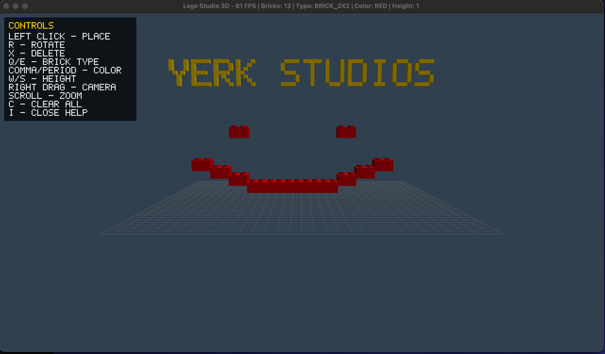

# Lego Studio 3D

A 3D Lego building application written in Java using LWJGL (OpenGL).



## Features

- 3D brick placement and building
- Multiple brick types (1x1, 1x2, 1x3, 1x4, 2x2, 2x3, 2x4, 2x6)
- 15 classic Lego colors
- Orbital camera with rotation, pan, and zoom
- Ghost brick preview for placement
- Collision detection
- In-app controls panel (press I)

## Requirements

- Java 21+
- Maven 3.6+
- OpenGL 3.3+ capable GPU

## Building & Running

```bash
# Build
mvn compile

# Run (macOS)
mvn exec:exec

# Or use the run script
./run.sh
```

## Controls

| Action | Key/Mouse |
|--------|-----------|
| Place brick | Left click |
| Rotate brick | R |
| Delete brick | X / Delete |
| Next brick type | E / ] |
| Previous brick type | Q / [ |
| Next color | . (period) |
| Previous color | , (comma) |
| Raise height | W / PageUp |
| Lower height | S / PageDown |
| Rotate camera | Right mouse drag |
| Pan camera | Middle mouse drag |
| Zoom | Scroll wheel |
| Clear all | C |
| Toggle help | I |
| Exit | Escape |

## Project Structure

```
lego-studio/
├── src/main/java/com/legostudio/
│   ├── LegoStudio.java          # Main application
│   ├── input/
│   │   └── InputHandler.java    # Mouse/keyboard input
│   ├── model/
│   │   ├── Brick.java           # Individual brick
│   │   ├── BrickColor.java      # Color definitions
│   │   ├── BrickType.java       # Brick dimensions
│   │   └── BrickWorld.java      # World/collision management
│   └── render/
│       ├── BrickMesh.java       # Brick geometry
│       ├── Camera.java          # Orbital camera
│       ├── GridMesh.java        # Baseplate grid
│       ├── MeshCache.java       # Mesh caching
│       ├── Renderer.java        # Main 3D renderer
│       ├── Shader.java          # OpenGL shader wrapper
│       ├── TextMesh3D.java      # 3D text rendering
│       └── UIRenderer.java      # 2D UI overlay
└── pom.xml
```

## License

MIT
